# Forecasting of Forex Market Based on Machine Learning Algorithms

## Introduction

The project explains how we can apply machine learning algorithms for forex market trend prediction with the help of past market data. The algorithms implemented in this project are ARIMA, Random Forest, RNN, and LSTM. The algorithms utilized here consume the past market data (500 days) of EURUSD and make use of technical indicators like moving averages, Relative Strength Indicator (RSI), Bollinger Bands, and others to teach our models.

## Data Sources

**OANDA**: Foreign exchange market real-time data collected via API.  
The data contains:  
- **time**: Timestamp of each price action (1 hour interval).  
- **open, high, low, close**: Prices for each interval.  
- **volume**: The volume traded during the interval.

## Prediction Objective

The goal is to provide predictions of Buy/Sell signals for the forex market. These predictions will help to inform trading decisions in real-time or aid in automated trading systems so that we can make calculated risks based on market states.

## Process Overview

We initially downloaded a dataset with identical structure to OANDA forex data but realized it did not provide real-time updates. Hence, we decided to use OANDA forex data only and applied feature engineering techniques on (open, high, low, close, volume, time). To improve the accuracy of predictions, macroeconomic data from FRED; however, OANDA updates in 1 hour intervals, while FRED updates quarterly/yearly. So, we decided to drop the extra dataset as it was adding less variance to our data.

Aside from the incompatibility between the two datasets, we also aim to focus on swing trading in this project, which requires short to medium-term price movements, something that the infrequently updated FRED data lacks.

Our dataset also showed imbalancement in target classes (Buy/Sell/Hold), influenced by the daily volatility of incoming live data. To address this, we applied RandomOverSampling to balance the dataset. We have used four machine learning models in this project to build our model: ARIMA, Random Forest, RNN, and LSTM. To optimize model performance, we used GridSearchCV, RandomizedSearchCV, and Keras' built-in tools to find the best hyperparameters for each model.

## Exploratory Data Analysis (EDA)

- **Number of Observations**: 500  
- **X and Y Variables**:  
    - **X**: Features extracted from the dataset (open, high, low, close, volume) along with engineered indicators such as MACD, RSI, future return, volatility bands, and other trend indicator signals.  
    - **Y**: Target variable representing trading signals — Buy (1), Sell (2), Hold (0).  

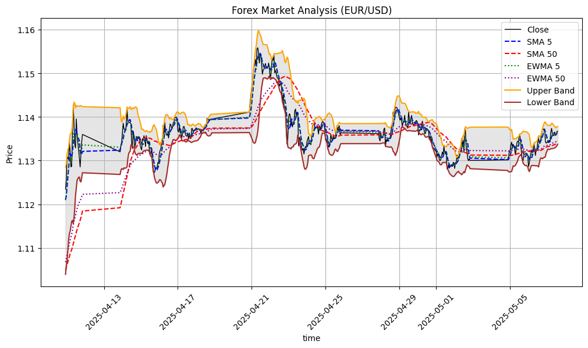

### Target Data Distribution

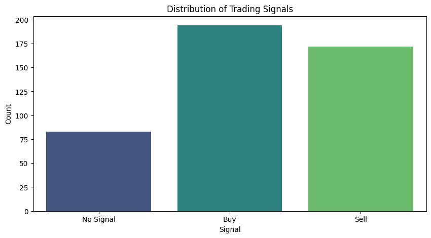

### Feature Correlation

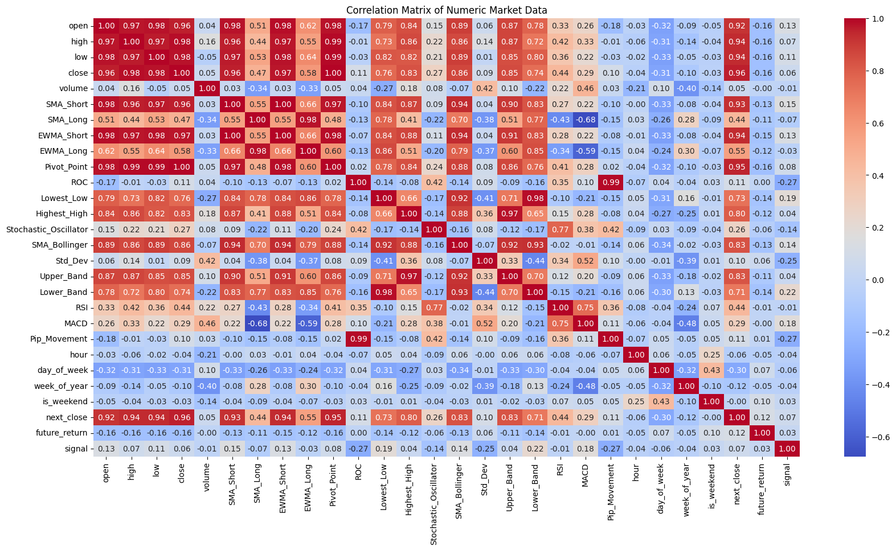

The correlation matrix highlights which features have the highest correlations between the price movements data and the feature engineered price-based indicators:
- **Open** and **Close** prices, a strong positive correlation.
- **High** and **Low** prices, strong positive correlation. As expected from a financial time series data these features would be closely related, since the price movements are within the same intervals. 
- **RSI (Relative Strength Index)**: Shows a moderate correlation with all price movement features(open,close,high,low).
- **Pip Movement** : has a weak negative correlation with all the price movement features. But has a 0.9 relation with **ROC(Rate of Change)**, which is an important factor in making trading decisions.
- **Volatility Bands**: The upper and lower bands show a strong correlation with **High** and **Low** prices, respectively, as they are derived from price volatility.
  
## Feature Importance

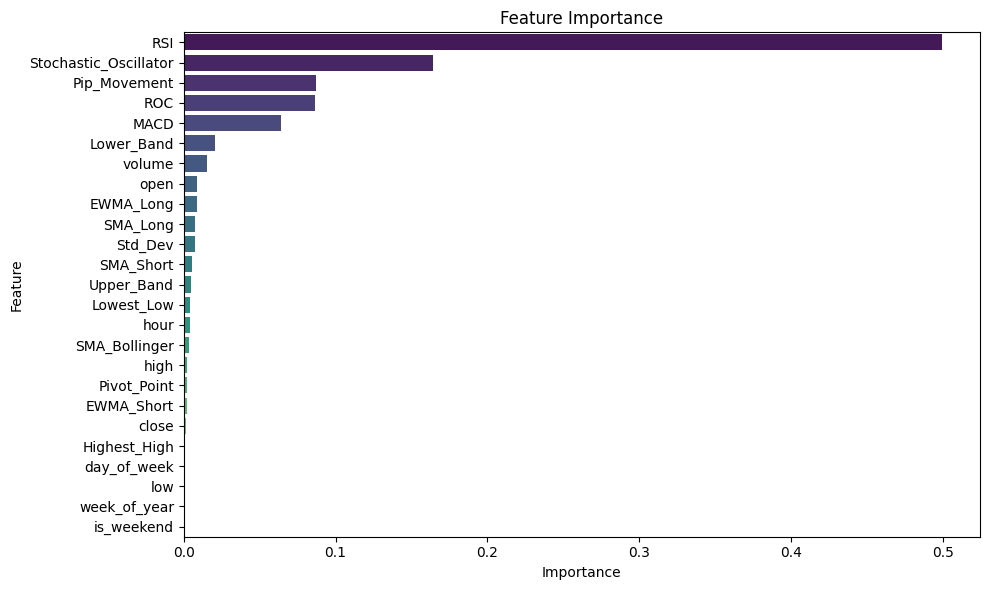

## Model Selection

The task is a classification problem, where we predict discrete classes (Buy/Sell/Hold).

### Model Fitting

**Train-Test Split and Data Leakage Risk**:  
To make a realistic evaluation, the dataset was chronologically ordered and split into three distinct segments:  
- **Training Data**: 70% of the earliest historical data  
- **Validation Data**: 15% of the mid-range data  
- **Test Data**: Final 15% representing the most recent data  

This time-based splitting approach avoids lookahead bias that would have been caused due to the 1 hour interval records, ensuring that future values are not leaked into the training process. The feature data was prepared by dropping non-numeric and identifier columns *(date_only, time, signal)* and separating the target variable *signal*, which represents Buy, Sell, or Hold actions.

To address class imbalance, RandomOverSampler from imblearn was applied to the training set. This step resampled the data to ensure that each class (Buy, Sell, Hold) was represented more evenly, reducing bias toward the dominant class. Finally, we used a MinMaxScaler to normalize the feature values. The scaler was fitted only on the resampled training data and then applied to the validation and test data.

### Model Choice

The following models were used to predict forex signals:

#### ARIMA

The Autoregressive Integrated Moving Average (ARIMA) is well-suited for forecasting continuous time series data. In our case, to align with ARIMA's requirements, we used the target variable future_return a continous variable. This allows ARIMA to forecast future returns, which can then be interpreted indirectly to inform Buy, Sell, or Hold decisions based on thresholds or strategy rules.  

**Confusion Matrix**

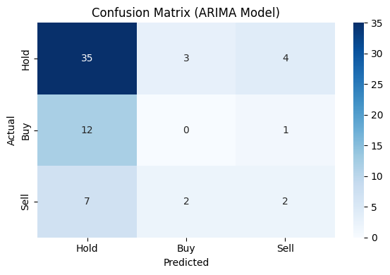

**Line Graph for Actual and Predicted Values**  

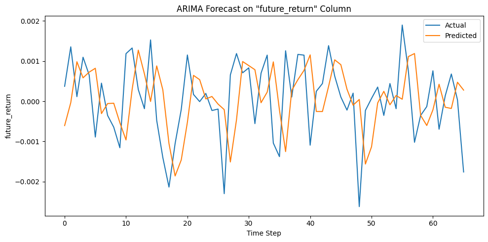

**Classification Report**

| Class   | Precision | Recall | F1-Score | Support |
|---------|-----------|--------|----------|---------|
| Hold    | 0.65      | 0.83   | 0.73     | 42      |
| Buy     | 0.00      | 0.00   | 0.00     | 13      |
| Sell    | 0.29      | 0.18   | 0.22     | 11      |
|         |           |        |          |         |
| **Accuracy**      |           |        | **0.56**     | **66**     |
| **Macro Avg**     | 0.31      | 0.34   | 0.32     | 66      |
| **Weighted Avg**  | 0.46      | 0.56   | 0.50     | 66      |

#### Ensemble Approach

**Random Forest**  
Random Forest is used to classify Buy, Sell, or Hold signals based on a variety of features. We believed it will do a better classification by capturing complex relationships between input features and target signals, while also handling feature importance efficiently.  

**Confusion Matrix**

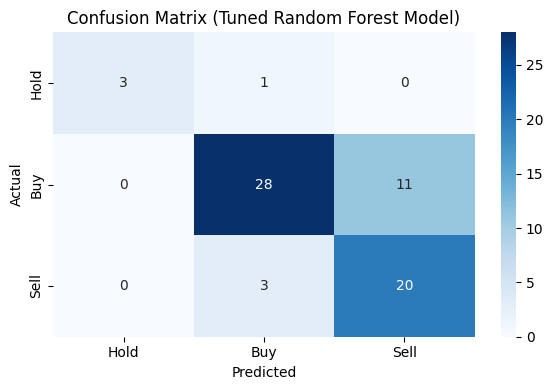

**Line Graph for Actual and Predicted Values**  

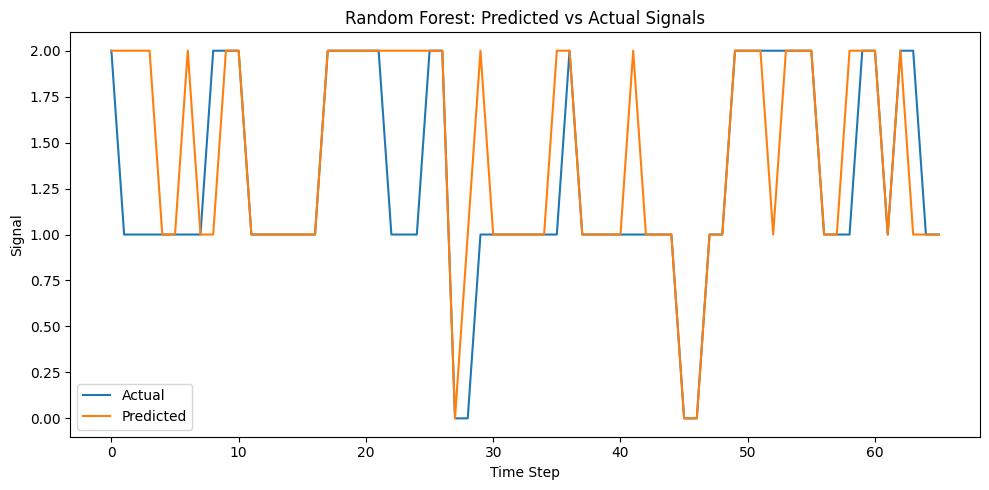

**Classification Report**

| Class            | Precision | Recall | F1-Score | Support |
| ---------------- | --------- | ------ | -------- | ------- |
| Hold             | 1.00      | 0.75   | 0.86     | 4       |
| Buy              | 0.91      | 0.74   | 0.82     | 39      |
| Sell             | 0.69      | 0.92   | 0.79     | 24      |
|                  |           |        |          |         |
| **Accuracy**     |           |        | **0.81** | **67**  |
| **Macro Avg**    | 0.86      | 0.80   | 0.82     | 67      |
| **Weighted Avg** | 0.83      | 0.81   | 0.81     | 67      |

#### Neural Network Approach
**LSTM**  
Long Short-Term Memory (LSTM) networks are an advanced type of RNN designed to capture both short and long-term dependencies in sequential data. LSTMs were applied for their ability to model complex temporal patterns in forex market trends more effectively.  

**Confusion Matrix**

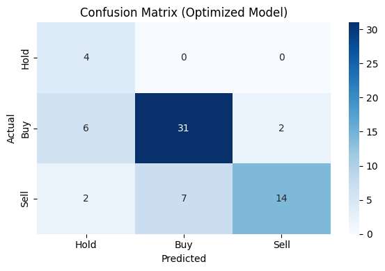

**Line Graph for Actual and Predicted Values**  

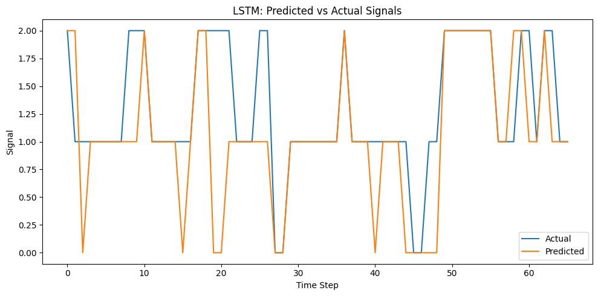

**Classification Report**

| Class | Precision | Recall | F1-Score | Support |
|-------|-----------|--------|----------|---------|
| Hold  | 0.20      | 0.50   | 0.29     | 4       |
| Buy   | 0.78      | 0.92   | 0.85     | 39      |
| Sell  | 0.91      | 0.42   | 0.57     | 24      |
|       |           |        |          |         |
| **Accuracy**      |         |        | **0.72** | **67** |
| **Macro Avg**     | 0.63    | 0.61   | 0.57     | 67      |
| **Weighted Avg**  | 0.79    | 0.72   | 0.71     | 67      |

**RNN**  
Recurrent Neural Networks (RNNs) are designed to capture temporal dependencies in sequential data. We used the RNN model to capture short-term patterns in forex market data by retaining information from previous time steps, making them well-suited for time series forecasting and signal classification.  

**Confusion Matrix**

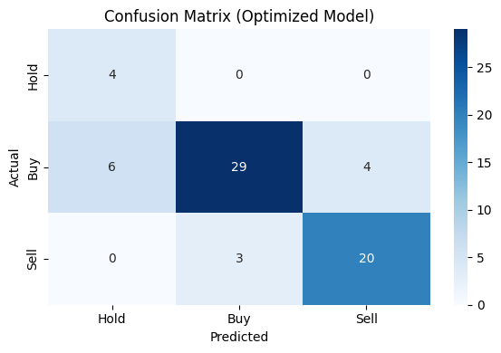

**Line Graph for Actual and Predicted Values**  

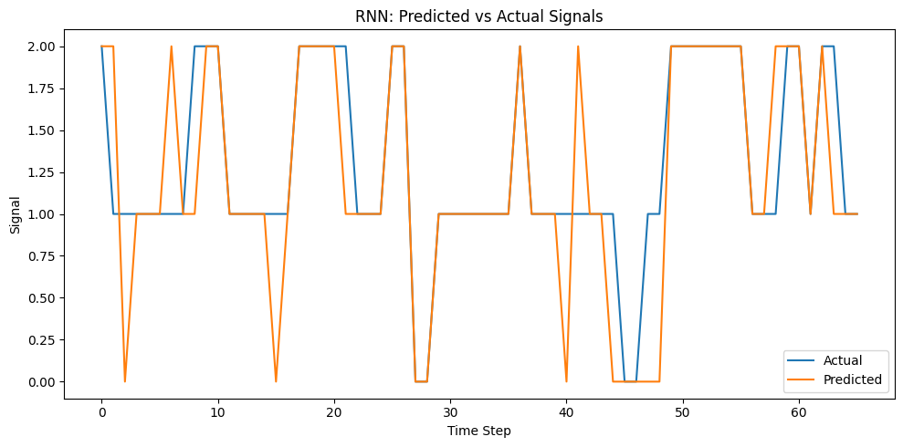

**Classification Report**

| Class | Precision | Recall | F1-Score | Support |
|-------|-----------|--------|----------|---------|
| Hold  | 0.50      | 0.75   | 0.60     | 4       |
| Buy   | 0.78      | 0.92   | 0.85     | 39      |
| Sell  | 0.87      | 0.54   | 0.67     | 24      |
|       |           |        |          |         |
| **Accuracy**      |         |        | **0.78** | **67** |
| **Macro Avg**     | 0.72    | 0.74   | 0.70     | 67      |
| **Weighted Avg**  | 0.80    | 0.78   | 0.77     | 67      |

## Conclusion and Observations

### Model Performance Overview

1. **ARIMA Model**
   - The **ARIMA** model performed with an accuracy of **56%**, primarily struggling with the classification of the "Buy" and "Sell" signals due to its linear nature and the class imbalance in the dataset.
   - **Precision and Recall for "Buy" and "Sell"**: Both of these classes exhibited very poor performance, indicating that ARIMA is not suited for capturing the complexities of short-term financial market movements for trading.

2. **Random Forest Model**
   - The **Random Forest** model delivered the best performance with an **accuracy of 81%**.
   - It demonstrated a strong ability to predict the **"Buy"** class with high precision and recall, making it the most reliable model for generating buy signals.
   - The **"Hold"** class showed perfect precision (1.00), and the **"Sell"** class was predicted with balanced performance, making this model a good all-rounder for trading decisions.
   - This model handled the class imbalance much better than others, likely due to its ensemble nature.

3. **LSTM Model**
   - The **LSTM** model achieved an **accuracy of 72%**.
   - It performed well in identifying **"Buy"** signals, with high precision and recall (0.78 and 0.92, respectively).
   - However, it faced challenges with the **"Hold"** class, exhibiting lower precision (0.50) but decent recall (0.75).
   - The **"Sell"** class performance was reasonable, with 0.87 precision but lower recall (0.42), indicating that it is more cautious in predicting sell signals.

4. **RNN Model**
   - The **RNN** model reached an **accuracy of 78%**.
   - Like LSTM, it performed well for the **"Buy"** class, showing high recall (0.92) and good precision (0.78).
   - **Hold** precision was moderate (0.50), but recall was solid (0.75), reflecting some struggle with the low-frequency "Hold" signals.
   - The **"Sell"** class was handled with precision (0.87) but at the cost of lower recall (0.54), showing a cautious approach to predicting sell signals.

## Conclusion and Observations

### Model Performance Overview

1. **ARIMA Model**
   - The **ARIMA** model performed with an accuracy of **56%**, struggling with the classification of the "Buy" and "Sell" signals
   - **Precision and Recall for "Buy" and "Sell"**: Both of these classes exhibited very poor performance, indicating that ARIMA is not suited to capture complexities of short-term financial movements for trading.

2. **Random Forest Model**
   - The **Random Forest** model performed best with an **accuracy of 81%**.
   - It demonstrated a strong ability to predict the **"Buy"** class with high precision and recall, making it the most reliable model for generating buy signals.
   - The **"Hold"** class had perfect precision 1.00, and the **"Sell"** class was predicted with balanced performance

3. **LSTM Model**
   - The **LSTM** model achieved an **accuracy of 72%**.
   - It performed well in identifying **"Buy"** signals, with high precision and recall 0.78 and 0.92, respectively.
   - It faced challenges with the **"Hold"** class, with lower precision 0.50 and recall 0.75.
   - The **"Sell"** class performance was 0.87 precision but lower recall 0.42, indicating that it is more cautious in predicting sell signals.

4. **RNN Model**
   - The **RNN** model reached an **accuracy of 78%**.
   - Like LSTM, it performed well for the **"Buy"** class, showing high recall 0.92 and good precision 0.78.
   - **Hold** precision was 0.50, but recall was 0.75, showing some struggle with the "Hold" signals.
   - The **"Sell"** class was  0.87 but with recall 0.54, showing a cautious approach to predicting sell signals.

### Key Observations

- **Best Performing Model**: The **Random Forest** model outperformed others with the highest accuracy 81% and good overall performance across all classes. It demonstrated balanced precision and recall, particularly excelling in predicting **"Buy"** signals.
  
- **Class Imbalance Handling**: **Random Forest** performed well in handling the class imbalance, but **ARIMA** and **LSTM** models struggled with the **"Hold"** class due to the lower frequency in the dataset. **Random Forest**  was able to manage the imbalance, resulting in more stable and reliable predictions.

- **Model Comparison**: Overall, the **Random Forest** model emerged as the most suitable for this project, but the **LSTM** and **RNN** models also showed good performance. The neural network shows a bit precaution when predicting the **Sell** signals

## Future Work

- Revisit the ARIMA model by engineering or finding a more suitable continuous target feature that helps give better forecasting
- Explore ways to integrate FRED data by engineering time aligned features that can be matched to OANDA’s timestamped records.
- Fine-tune threshold values for classification models to improve **signal** precision in live trading scenarios.
